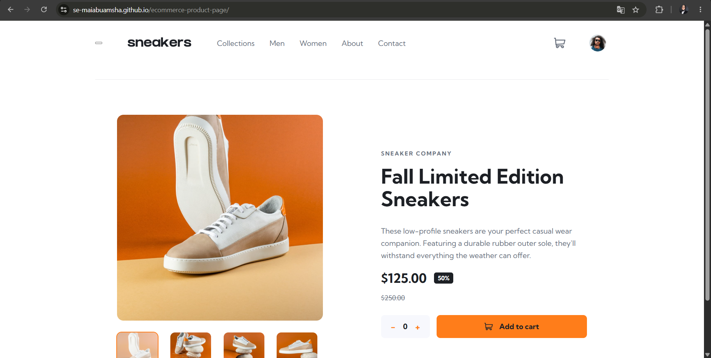

# Frontend Mentor - E-commerce product page solution

This is a solution to the [E-commerce product page challenge on Frontend Mentor](https://www.frontendmentor.io/challenges/ecommerce-product-page-UPsZ9MJp6). Frontend Mentor challenges help you improve your coding skills by building realistic projects.

## Table of contents

- [Overview](#overview)
  - [The challenge](#the-challenge)
  - [Screenshot](#screenshot)
  - [Links](#links)
- [My process](#my-process)
  - [Built with](#built-with)
  - [What I learned](#what-i-learned)
  - [Continued development](#continued-development)
  - [Useful resources](#useful-resources)
  - [AI Collaboration](#ai-collaboration)
- [Author](#author)
- [Acknowledgments](#acknowledgments)

## Overview

### The challenge

Users should be able to:

- View the optimal layout for the site depending on their device's screen size
- See hover states for all interactive elements on the page
- Open a lightbox gallery by clicking on the large product image
- Switch the large product image by clicking on the small thumbnail images
- Add items to the cart
- View the cart and remove items from it

### Screenshot

### Links

- Solution URL: [Github Repo](https://github.com/SE-MaiAbuAmsha/ecommerce-product-page)
- Live Site URL: [Live Dimo](https://se-maiabuamsha.github.io/ecommerce-product-page/)

## My process

### Built with

- Semantic HTML5 markup
- CSS custom properties
- Flexbox
- CSS Grid
- Mobile-first workflow
- Vanilla JavaScript (no framework)

### What I learned

- Managing UI state in vanilla JavaScript (cart, quantity, lightbox)
- Responsive layout decisions (burger menu vs. horizontal nav)
- GitHub Pages deployment and relative path gotchas

### Continued development

- Deeper accessibility testing with screen readers
- CSS architecture patterns (BEM at scale)
- Unit testing for cart logic
  **What worked well:** Explaining concepts and suggesting alternatives rather than writing code for me.

**What I'd do differently:** Write more code myself before asking for help, to build stronger muscle memory

### AI Collaboration

I used Claude as a learning partner for:

- Discussing architecture and trade-offs
- Debugging CSS layout issues
- Reviewing accessibility approach

## Author

- Frontend Mentor - [@SE-MaiAbuAmsha](https://www.frontendmentor.io/profile/SE-MaiAbuAmsha)
- GitHub - [@SE-MaiAbuAmsha](https://github.com/SE-MaiAbuAmsha)

## Acknowledgments

Thanks to the Frontend Mentor community for feedback on my accessibility approach.
